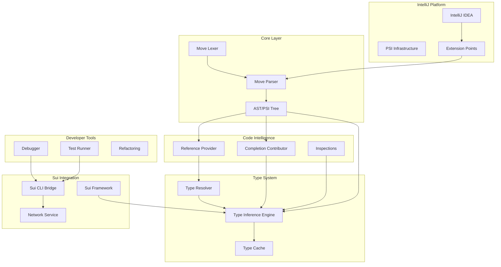
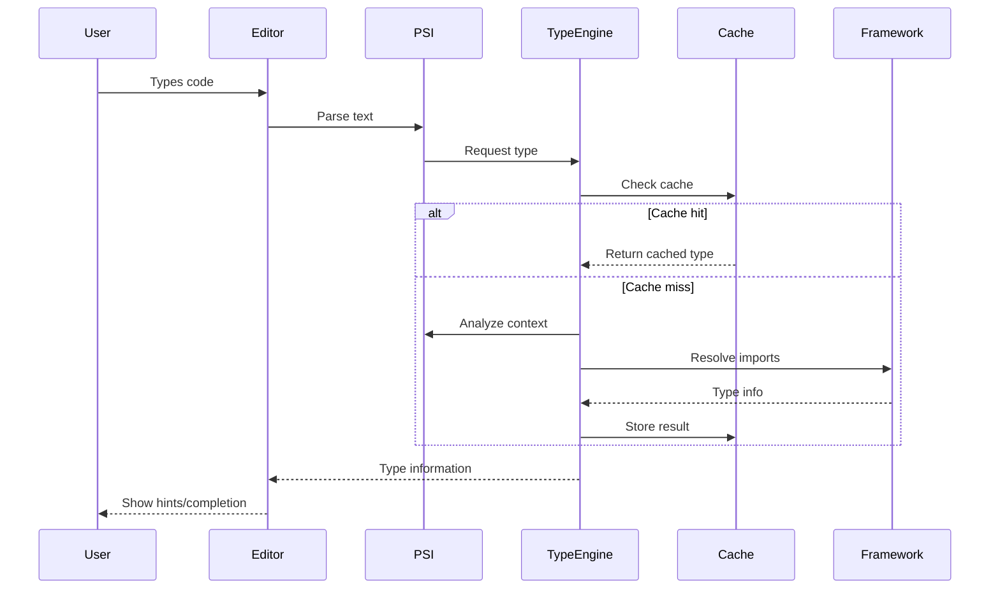
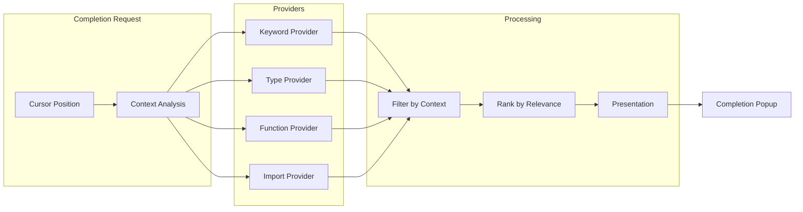
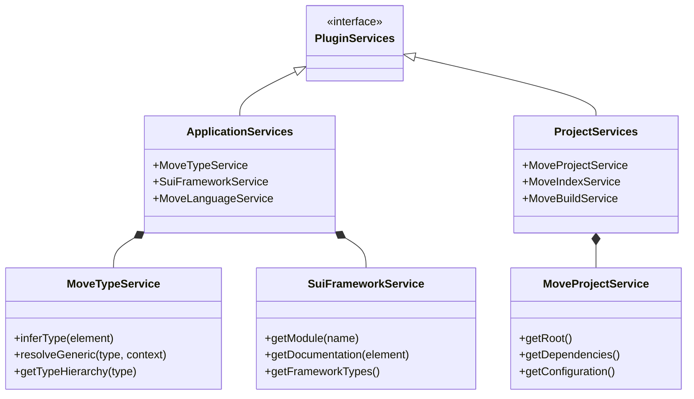
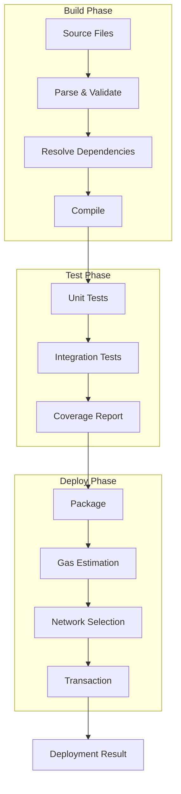
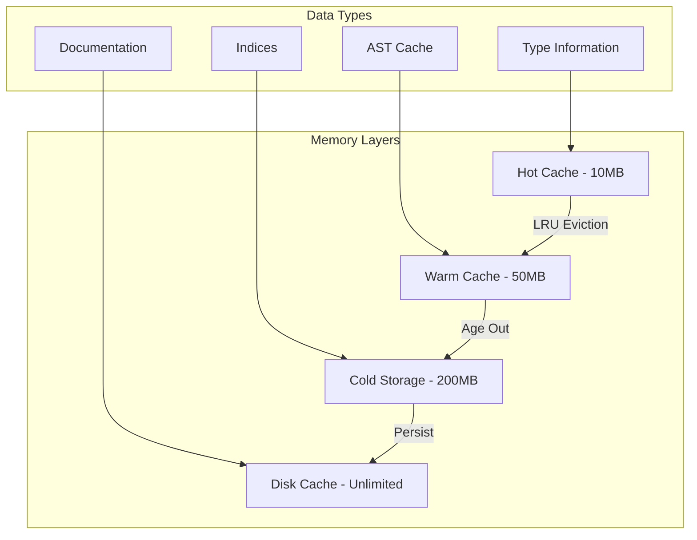
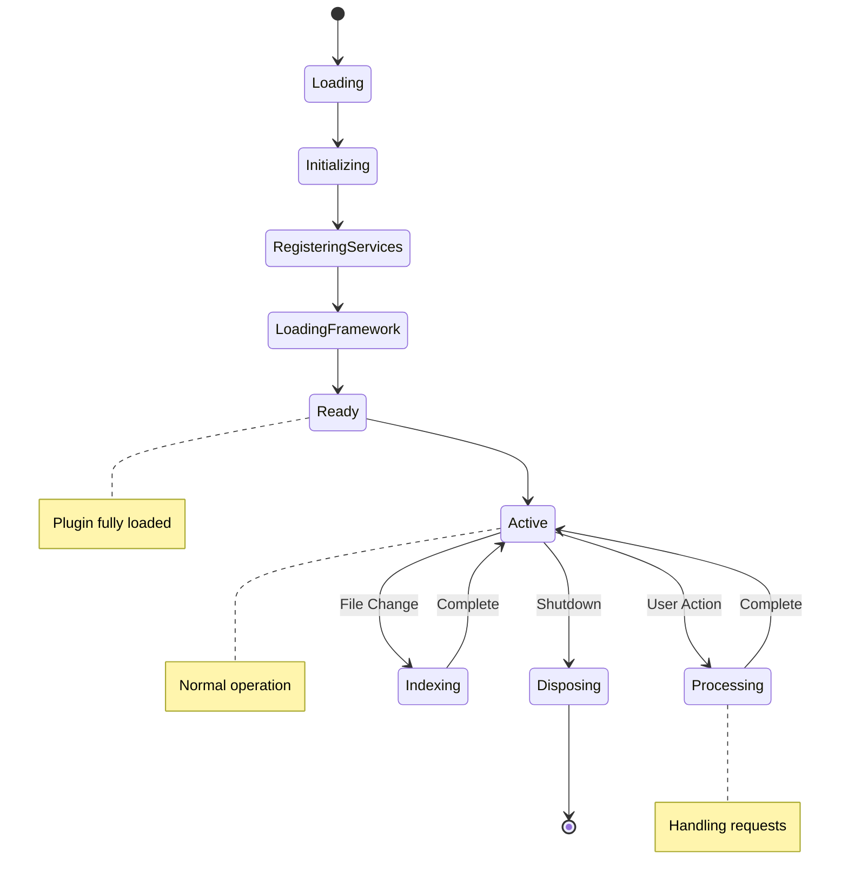
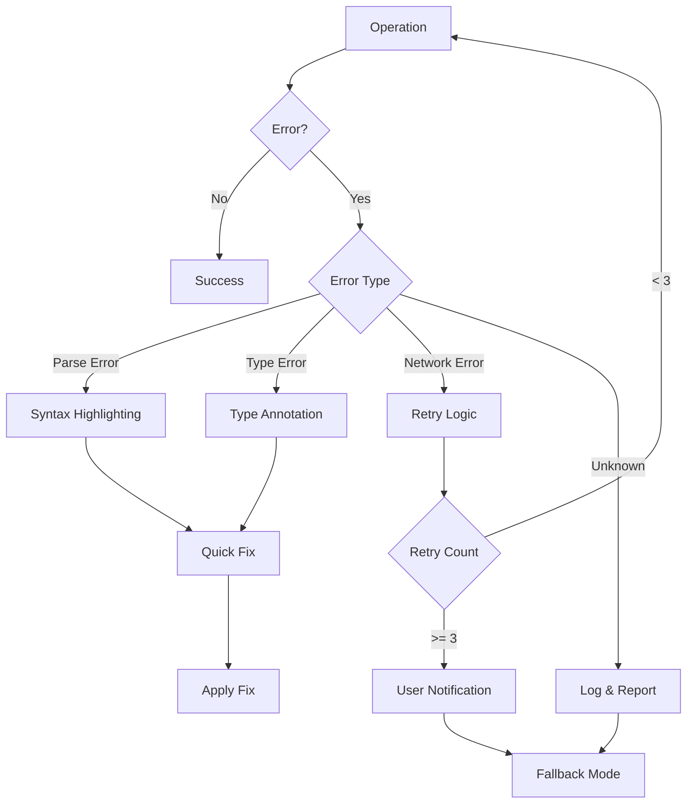
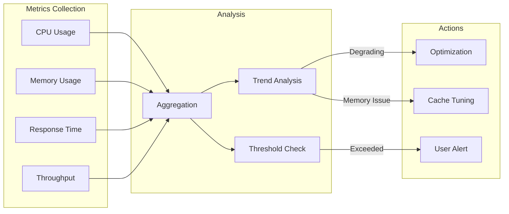

# Sui Move Plugin v2.0 - Architecture Diagrams

## Component Interaction Diagram

## Type Resolution Flow

## Code Completion Architecture

## Service Layer Architecture

## Build & Deploy Pipeline

## Memory Management Strategy

## Plugin Lifecycle

## Error Handling Flow

## Performance Monitoring

---

These diagrams provide a visual representation of the v2.0 architecture, showing how components interact and data flows through the system.
